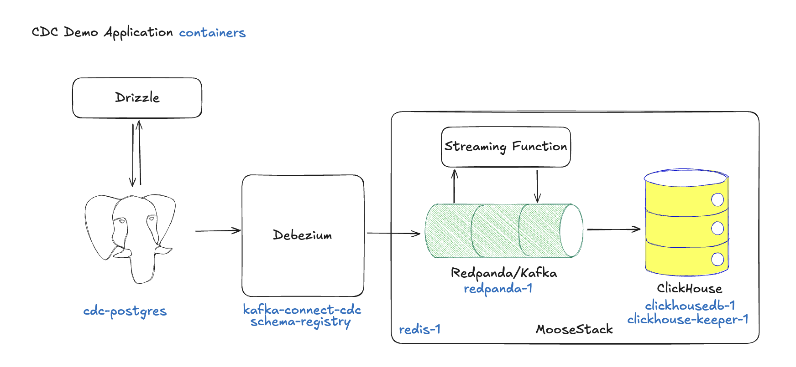

# Debezium CDC with Moose & Drizzle

Easy-to-run demo of a CDC pipeline using Debezium (Kafka Connect), PostgreSQL, Redpanda, and ClickHouse.



## 🚀 Quick Start

### Prerequisites

- Docker + Docker Compose
- Node.js 20+ and pnpm
- Moose CLI: `bash -i <(curl -fsSL https://fiveonefour.com/install.sh) moose`

### 1) Clone & Install

```bash
gh repo clone okane16/debezium-cdc
cd debezium-cdc
pnpm install
```

### 2) Start Dev Environment (keep this terminal open)

```bash
moose dev
```

This starts the Moose dev server, which:

- Spins up local ClickHouse and Redpanda
- Starts all CDC services defined in `docker-compose.dev.override.yaml` (PostgreSQL, Debezium Kafka Connect, Apicurio Schema Registry)
- Manages lifecycle: when you stop the dev server, these containers are torn down automatically

On first start, Moose runs the script configured in `moose.config.toml`:

```toml
[http_server_config]
...
on_first_start_script = "./setup-cdc.sh"
```

What `setup-cdc.sh` does:

- Pushes the Drizzle schema from `app/oltp/schema.ts` to the local PostgreSQL
- Seeds tables with random sample data
- Creates or updates the Debezium postgres connector, using the JSON config in `postgres-connector.json`

You’ll see the script’s output and subsequent CDC logs in the same terminal where you ran `moose dev`.

### 3) Seed Data (new terminal)

The startup script will seed 10 rows per table. You can seed more rows by running the following commands:

```bash
# Seed all tables (10 records each)
pnpm db:seed

# Or seed specific tables / counts
pnpm db:seed:customers 100
pnpm db:seed:another 50

# Clear data
pnpm db:clear
pnpm db:clear:customers
pnpm db:clear:another
```

### 4) Optional: Open Drizzle Studio

The Drizzle Studio GUI lets you easily view, edit, and delete rows in your PostgreSQL database tables. This is a great way to trigger CDC events and observe the data flowing into ClickHouse.

```bash
pnpm db:studio  # http://local.drizzle.studio/
```

## Detailed Streaming Pipeline Diagram


## 📁 app/ Structure

```text
app/
├── cdc/
│   ├── 1-sources/                  # CDC Kafka topics
│   │   ├── externalTopics.ts       # AUTO-GENERATED by `moose kafka pull`
│   │   └── typed-topics.ts         # Typed wrappers around generated topics
│   ├── 2-transforms/               # CDC transforms
│   │   ├── payload-handler.ts      # Generic CDC handler (insert/update/delete)
│   │   ├── customer-addresses.ts   # Per-table transform
│   │   └── another-table.ts        # Per-table transform
│   └── 3-destinations/             # ClickHouse targets
│       ├── olap-tables.ts          # Click table definitions (ReplacingMergeTree)
│       └── sink-topics.ts          # Streaming buffers to store results from transforms before writing to ClickHouse tables
├── oltp/
│   ├── connection.ts               # PostgreSQL connection (Drizzle)
│   ├── schema.ts                   # Drizzle schema
│   └── seed.ts                     # Seeding CLI
├── models.ts                       # Shared types
└── index.ts                        # Entry point
```

Numbered folders visualize flow: 1-sources → 2-transforms → 3-destinations.

## 🔧 Useful Commands

```bash
# App
moose dev                 # Start Moose dev environment
moose build               # Build for production
moose truncate --all      # Clear all ClickHouse tables

# Data
pnpm db:seed             # Seed all tables (default: 10 each)
pnpm db:seed:customers 100
pnpm db:seed:another 50
pnpm db:clear            # Clear all tables
pnpm db:studio           # Open Drizzle Studio

# Kafka (inside Redpanda container)
pnpm dev:kafka:pull # Pull Kafka topics from Redpanda
docker exec debezium-cdc-redpanda-1 rpk topic list
docker exec debezium-cdc-redpanda-1 rpk topic consume pg-cdc.public.customer_addresses --num 5
docker exec debezium-cdc-redpanda-1 rpk topic consume pg-cdc.public.another_table --num 5
```

## ⚙️ Configuration

```bash
# app/oltp/connection.ts defaults
DB_HOST=localhost
DB_PORT=5433
DB_NAME=test-db
DB_USER=postgres
DB_PASSWORD=postgres
```

Debezium connector (see `postgres-connector.json`) streams:

- `public.customer_addresses` → `pg-cdc.public.customer_addresses`
- `public.another_table` → `pg-cdc.public.another_table`

### Debezium connector config: most important settings

- `topic.prefix` — Prefix for all emitted Kafka topics. Final topics look like `<topic.prefix>.public.<table>`.
- `table.include.list` — Which tables to capture. Use schema-qualified names or patterns (e.g., `public.*` or `public.customer_addresses,public.another_table`).

Example:

```json
{
  "topic.prefix": "pg-cdc",
  "table.include.list": "public.*"
}
```

See `postgres-connector.jsonc` for an annotated, human-friendly version. The actual file used by the setup script is `postgres-connector.json` (must be plain JSON, no comments).

## 🐛 Troubleshooting

- If `setup-cdc.sh` fails: `chmod +x setup-cdc.sh` then `moose dev`
- Check connector: `curl http://localhost:8084/connectors/postgres-connector/status`
- Verify topics: `cat app/cdc/1-sources/externalTopics.ts`

- If not all dev containers start with `moose dev`: stop the dev server, clear Docker volumes, and retry. This resets local data (PostgreSQL, ClickHouse, Redpanda).

  ```bash
  # Stop Moose dev (Ctrl+C in the terminal running it)
  # Tear down containers and remove volumes created by the compose override
  docker compose -f docker-compose.dev.override.yaml down -v --remove-orphans

  # Optional cleanup of dangling volumes/networks
  docker volume prune -f
  docker network prune -f

  # Start again
  moose dev

  # Re-seed if needed
  pnpm db:seed
  ```

## 📚 References

- Debezium: https://debezium.io/
- Moose: https://docs.moosejs.com/
- Drizzle ORM: https://orm.drizzle.team/
- Redpanda: https://docs.redpanda.com/
- ClickHouse: https://clickhouse.com/docs
